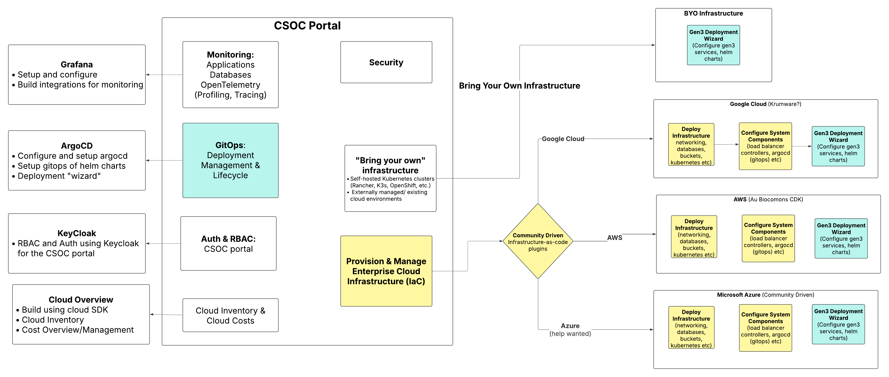
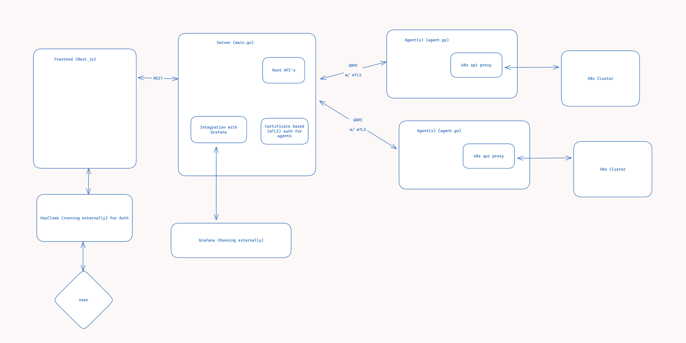

# Gen3 CSOC (Cloud Security Operations Center)

A comprehensive admin dashboard and platform for managing Gen3 deployments across multiple Kubernetes clusters with enterprise-scale infrastructure management capabilities.

## Overview

The Gen3 CSOC Dashboard is a centralized platform designed to facilitate the management of multiple Gen3 deployments and Kubernetes clusters. Built with scalability and enterprise requirements in mind, it provides system administrators and operators with a comprehensive set of tools to deploy, monitor, and manage their Gen3 ecosystems effectively across cloud-native environments.

## High-Level Architecture




### Agent/Server Architecture
The platform follows a distributed agent/server architecture enabling centralized management of multiple Kubernetes clusters:

- **Central Server**: Go-based API server with REST endpoints and gRPC communication
- **Gen3 Agents**: Deployed to each target Kubernetes cluster, acting as secure proxies
- **Frontend Dashboard**: Next.js application providing unified management interface
- **External Integrations**: KeyCloak for authentication, Grafana for monitoring

### Technology Stack

**Frontend**
- Next.js with Pages Router
- Mantine UI component library
- REST API communication with backend

**Backend**
- Go API using Gin framework
- gRPC with mTLS for secure agent communication
- Kubernetes API integration based on current context
- Certificate-based authentication for agents

**Infrastructure**
- Kubernetes-native deployment model
- Helm charts for application management
- ArgoCD for GitOps workflows
- Multi-cloud support (AWS, Google Cloud, Azure)

## Core Features

### 🚀 Gen3 Deployment Management
- **Multi-Environment Support**: Manage production, development, and testing environments from a single interface
- **Helm-Based Deployment**: Leverage Helm charts for consistent Gen3 component deployment
- **Deployment Wizard**: Guided setup process for new Gen3 installations
- **Configuration Management**: Centralized configuration for services, load balancers, and system components

### ☸️ Kubernetes Cluster Management
- **Multi-Cluster Support**: Manage multiple Kubernetes clusters from one dashboard
- **Resource Monitoring**: Real-time visibility into pods, services, deployments, and ConfigMaps
- **Cluster Health**: Monitor node health, resource usage, and system metrics
- **RBAC Integration**: Kubernetes Role-Based Access Control integration
- **Custom Resource Management**: Support for Gen3-specific Kubernetes resources

### 🔧 DevOps & GitOps Integration
- **Helm Support**: Native Helm chart management and deployment
- **ArgoCD Integration**: GitOps workflow implementation for declarative deployments
- **Deployment Lifecycle**: Complete application lifecycle management
- **Version Control**: Git-based configuration management
- **Automated Synchronization**: Continuous deployment with ArgoCD

### 🏗️ Infrastructure as Code (IaC)
- **Multi-Cloud Support**:
  - **AWS**: EKS integration
  - **Google Cloud**: GKE support
  - **Microsoft Azure**: AKS support
- **Infrastructure Provisioning**: Automated cloud infrastructure deployment
- **Network Configuration**: Load balancer and networking setup
- **Storage Management**: Persistent volume and database configuration
- **BYOI (Bring Your Own Infrastructure)**: Support for existing infrastructure

### 📊 Monitoring & Observability
- **Grafana Integration**: Built-in monitoring dashboard setup and configuration
- **Application Monitoring**: Gen3 service health and performance metrics
- **Database Monitoring**: Database performance and connectivity monitoring
- **OpenTelemetry**: Distributed tracing and profiling capabilities
- **Custom Metrics**: Gen3-specific monitoring and alerting

### 🔐 Security & Authentication
- **KeyCloak Integration**: Enterprise authentication and authorization
- **RBAC**: Role-based access control for the CSOC portal
- **Certificate Management**: Automated TLS certificate provisioning
- **Secure Agent Communication**: mTLS encrypted communication between server and agents
- **Multi-Tenant Security**: Isolated environments for different teams/projects

### 💰 Cloud Cost Management
- **Cloud Inventory**: Multi-cloud resource inventory and tracking
- **Cost Analysis**: Cloud spending overview and optimization recommendations
- **Resource Optimization**: Right-sizing recommendations for cloud resources
- **Budget Monitoring**: Cost alerts and budget management

## Getting Started

### Prerequisites
- Kubernetes cluster with kubectl configured
- Docker (for local development)
- Node.js and npm
- Go 1.19+ (for backend development)

### Development Environment Setup

1. **Ensure kubectl is configured** with access to your target Kubernetes cluster:
   ```bash
   kubectl cluster-info
   ```

2. **Start the API server**:
   ```bash
   cd api/
   export PORT=8002
   nodemon --exec go run main.go --signal SIGTERM
   ```

3. **Start the frontend** (in a separate terminal):
   ```bash
   cd frontend/
   npm install
   npm run dev
   ```

4. **Access the dashboard** at `http://localhost:3000`

5. **Create Agent Configuration** (First-time setup):

   If this is the first time you're setting up a dev environment, you need to create the certificates for agent communication.

   - Create agent configuration in the UI by browsing to: `http://localhost:3000/clusters`
   - Click "Import existing cluster"
   - Give it a name and hit the import button
   - This will create the certificates needed for secure agent communication

6. **Start Agent** (for development):

   Use the cluster name from the previous step:
   ```bash
   nodemon --exec go run gen3-agent/agent.go --name <CLUSTER_NAME> --signal SIGTERM
   ```


### Keycloak Setup Guide: Realm, Client, User, Role, and Group

#### Prerequisites

- Keycloak server running at `http://localhost:8080`
- Admin credentials for Keycloak Admin Console

### Steps

#### 1. Create Realm

- Log in to Admin Console at `http://localhost:8080`.
- Hover over current realm (e.g., "Master"), click **Create realm**.
- Name: `csoc-realm`.
- Click **Create**.

#### 2. Create Client

- In `csoc-realm`, go to **Clients** &gt; **Create client**.
- **Client ID**: `csoc-client`.
- **Client Protocol**: `openid-connect`.
- Click **Next**.
- Enable **Client authentication**, **Standard flow**, **Direct access grants**.
- Click **Next**.
- Set **Valid redirect URIs**: `http://localhost:3000/*`.
- Set **Web origins**: `http://localhost:3000`.
- Click **Save**.
- Go to **Credentials** tab, copy **Client secret** for your app.

#### 3. Create Role

- Go to **Realm roles** &gt; **Create role**.
- **Role name**: `csoc-role`.
- Click **Save**.

#### 4. Create User

- Go to **Users** &gt; **Add user**.
- **Username**: `csoc-user`.
- **Email**: `john@example.com` (optional: First/Last name, enable **Email Verified**).
- Click **Save**.
- Go to **Credentials** tab, click **Set password**.
- Enter password, disable **Temporary** for permanent password.
- Click **Save**.

#### 5. Assign Role to User

- In **Users**, select `csoc-user`.
- Go to **Role mapping** tab.
- Select `csoc-role` from **Available roles**.
- Click **Add selected**.

#### 6. Create Group

- Go to **Groups** &gt; **New**.
- **Group name**: `csoc-group`.
- Click **Save**.

#### 7. Add User to Group

- In **Users**, select `csoc-user`.
- Go to **Groups** tab.
- Select `csoc-group`, click **Join**.

#### 8. Configure Token Mappings

- Go to **Clients** &gt; `csoc-client` &gt; **Mappers** tab.
- **For Roles**:
  - Click **Create**.
  - **Name**: `roles`.
  - **Mapper Type**: `User Role`.
  - **Token Claim Name**: `roles`.
  - **Claim JSON Type**: `String` (or `Array`).
  - Enable **Add to ID token**, **Add to access token**, **Add to userinfo**.
  - Enable **Multivalued**.
  - Click **Save**.
- **For Groups**:
  - Click **Create**.
  - **Name**: `groups`.
  - **Mapper Type**: `Group Membership`.
  - **Token Claim Name**: `groups`.
  - **Full group path**: `OFF`.
  - Enable **Add to ID token**, **Add to access token**, **Add to userinfo**.
  - Click **Save**.


## Project Structure

```
gen3-csoc/
├── api/                    # Go backend API
│   ├── main.go            # API server entry point
│   ├── handlers/          # REST API handlers
│   ├── grpc/             # gRPC server for agent communication
│   └── k8s/              # Kubernetes client integration
├── frontend/              # Next.js frontend
│   ├── pages/            # Page components (Pages Router)
│   ├── components/       # Reusable UI components
│   └── lib/              # Utility functions
├── agents/               # Gen3 agent codebase
│   └── agent.go         # Agent implementation
└── charts/              # Helm charts for deployment
```

## Deployment Options

### Managed Infrastructure
- **AWS**: Automated EKS deployment with Biocommons CDK
- **Google Cloud**: GKE setup with integrated tooling
- **Azure**: AKS deployment (community support)

### Bring Your Own Infrastructure (BYOI)
- Self-hosted Kubernetes clusters (Rancher, K3s, OpenShift)
- Existing cloud environments
- On-premises infrastructure

## Roadmap

- TBD

## Contributing

This project is developed by the Platform Engineering (PE) team. For contributions:

1. Fork the repository
2. Create a feature branch
3. Make your changes
4. Submit a pull request

## Architecture Diagrams

The platform architecture includes:
- **CSOC Portal**: Central management interface
- **Agent Network**: Distributed agents for cluster management
- **Cloud Integration**: Multi-cloud infrastructure support
- **Monitoring Stack**: Integrated observability platform

## Support

For issues, questions, or contributions, please contact the Platform Engineering team or create an issue in the project repository.

---

**Note**: This is an active development project. Features and documentation are continuously evolving as the platform matures.
